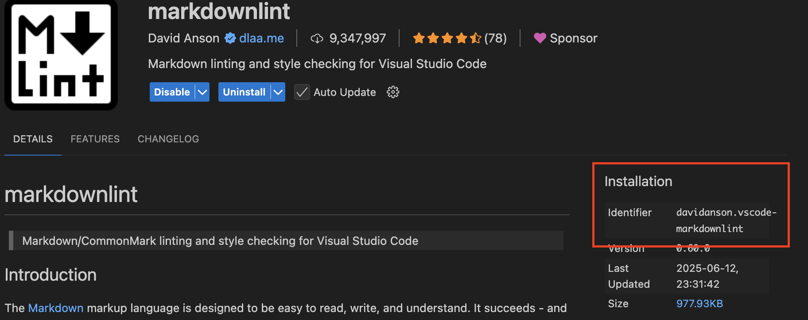

# 🏗️ Automated Tools & Environment Management for macOS

## ✨ Overview

(Almost) fully automated solution for configuring and personalizing your macOS environment using [Ansible](https://www.ansible.com/).

It streamlines the installation of essential tools, dotfiles, system settings, and developer utilities, making your Mac ready for productivity in minutes.

> [!WARNING]
> Supported Operating System - `MacOS`

### 🤔 Why Ansible?

Managing dotfiles and setting up a new system should be **fast**, **reliable**,
and **reproducible** — without needing to manually install a bunch of things
every time.

Ansible provides a **declarative**, **idempotent**, and **powerful** way to
automate:

- Installing system packages
- Configuring user environments
- Managing dotfiles

### 🧰 Features

- **Homebrew & Package Management**: Installs and updates Homebrew, plus your favorite CLI and GUI apps.
- **Dotfiles & Configs**: Deploys custom dotfiles for zsh, nvim, git, and more.
- **System Tweaks**: Automates macOS settings (Dock, Finder, keyboard, mouse, trackpad).
- **Developer Tools**: Installs SDKMAN, Java, Maven, VS Code extensions, and more.
- **Shell Enhancements**: Sets up Oh My Zsh, Oh My Posh, aliases, and utilities.
- **Modular Roles**: Easily extend or customize with Ansible roles for each component.

---

## ⚡ Quick Usage

```bash
ansible-galaxy collection install community.general \
&& ansible-pull \
  -U http://github.com/Nikola-Popov/macos-setup \
  -d ~/.ansible/pull/macos-setup \
  -c ~/.ansible/pull/macos-setup/ansible.cfg \
  playbooks/site.yml
```

### ⚙️ Dynamic Configuration (Extra Vars)

Below is a list of all variables you can modify at runtime to customize your setup.

| Variable                | Type     | Example Value                      | Description                                               |
|-------------------------|----------|------------------------------------|-----------------------------------------------------------|
| `git_name`              | string   | `git_name='Your Name'`             | Sets your global Git user name                            |
| `git_email`             | string   | `git_email=user@example.com`       | Sets your global Git email address                        |
| `pyenv_global_version`  | string   | `pyenv_global_version=3.11.6`      | Sets the global Python version for pyenv                  |
| `pyenv_python_versions` | list     | `pyenv_python_versions=['3.11.6','3.12.2']` | List of Python versions to install with pyenv             |
| `sdkman_sapmachine_java_version` | integer   | `sdkman_sapmachine_java_version=17` | Sets the SAP Machine Java version with SDKMAN            |
| `workspace_dir`         | string   | `workspace_dir=/Users/me/workspace` | Sets your workspace directory                        |

#### Examples

You can customize your setup by passing variables to Ansible using the `-e` flag.  
This lets you set values directly (like `key=value`), or load them from a JSON or YAML file (using `@filename`).  
You can use `-e` as many times as you need in one command.

1. Pass variables directly with `-e`:

   ```bash
   ansible-pull \
     ...
     -e "git_name='Your Name' pyenv_global_version=3.11.6 workspace_dir=/Users/me/workspace" \
     playbooks/site.yml
   ```

   or

    ```bash
   ansible-pull \
     ...
     -e "git_name='Your Name'" \
     -e "pyenv_global_version=3.11.6" \
     -e "workspace_dir=/Users/me/workspace" \
     playbooks/site.yml
   ```

2. Create a YAML file (e.g. `myvars.yml`) with your variables:
  Store your configuration in a file for easy reuse and sharing.

   ```yml
   git_name: "Your Name"
   pyenv_global_version: "3.11.6"
   workspace_dir: "/Users/me/workspace"
   ```

   Then run:

   ```bash
   ansible-pull \
     ...
     -e @myvars.yml \
     playbooks/site.yml
   ```

---

## 📝 Additional Post-Setup Manual Actions

There are steps which cannot be automated completely. Therefore, manually apply the pre-exported settings (stored in the /settings folder) to their respective tools.

> [!NOTE]
> This relies on the playbook is executed at least once. Refer to the '⚡ Quick Usage' or '🛠️ Local Setup' sections to see how.

### 💻 IntelliJ

```text
Choose File | Manage IDE Settings | Import Settings from the main menu.

In the Import File Location dialog that opens select the desired archive.

In the Select Components to Import dialog that opens specify the settings to be imported, and click OK. By default, all settings are selected.
```

### 🌟 Raycast

```text
Settings | Advanced | Import

Select the .rayconfig file.
```

> [!NOTE]
> The rayconfig is password protected. The password is `12345678`.

### 🔑 Authenticate with GitHub using Git Credential Manager

Git Credential Manager (GCM) provides secure credential storage and authentication for Git. To log in to GitHub and securely cache your credentials, run:

```bash
git-credential-manager github login --url https://github.com/
```

This command will:

1. Open a browser window where you’ll be prompted to sign in to GitHub.

2. Authenticate either with your GitHub username/password + 2FA, or using a personal access token (PAT).

3. Store the credentials securely in your system’s credential store (e.g., Windows Credential Manager, macOS Keychain, or Linux Secret Service).

4. Once authenticated, Git will automatically use these stored credentials for future operations (such as git clone, git pull, and git push) without asking for your password again.

---

## 🧑‍💻 Development

### 🛠️ Local Setup

Prepare the environment with these one-time actions.

```bash
# clone the project and navigate to it
git clone git@github.com:Nikola-Popov/macos-setup.git && cd macos-setup

# install dependencies (i.e. Ansible community collections)
ansible-galaxy collection install community.general
```

Run the playbook:

```bash
ansible-playbook playbooks/site.yml
```

### 🧩 Extending & Customization

#### 🪛 New workflows

Add or modify roles in `roles/` to suit your workflow. Create a new role in `roles/` by:

```bash
ansible-galaxy init roles/<rolename>
```

Later, include the role in one of the playbooks in `playbooks/`, so that it's picked-up and executed by Ansible.

#### 📦 Profile-Based Installation of Homebrew packages

This role installs Homebrew packages and cask applications on macOS based on profile-driven configuration. You can define multiple profiles and selectively enable them to control which packages are installed.

The packages are grouped under named profiles (e.g., `general`, `dev`) in `roles/homebrew/packages.yml`such as:

```yml
# Example package grouping
homebrew_package_profiles:
  general:
    packages:
      - eza
      - neovim
    cask_packages:
      - raycast

  dev:
    packages:
      - node
      - helm
    cask_packages:
      - docker
```

Then in `group_vars/all.yml` you can decive which package group to install by listing them as such:

```yml
# Example package group/profile selection
homebrew_profiles_enabled:
  - general
  - dev
```

#### 🧩 Install VS Code Extensions

All VS Code extensions required for this setup are listed in `roles/vscode/files/extensions.txt`. Each line in this file is the unique identifier for a VS Code extension (for example, `ms-python.python`).

You can find the extension identifier on the extension's page in the VS Code Marketplace, as shown below:



To install a new extension, simply add its identifier to `extensions.txt` and re-run the playbook. The setup will automatically install all listed extensions for you.

---

## 📜 License

This project is licensed under the MIT License.  
You are free to use, modify, and distribute this software with proper attribution. See the [MIT License](LICENSE) file for full details.
